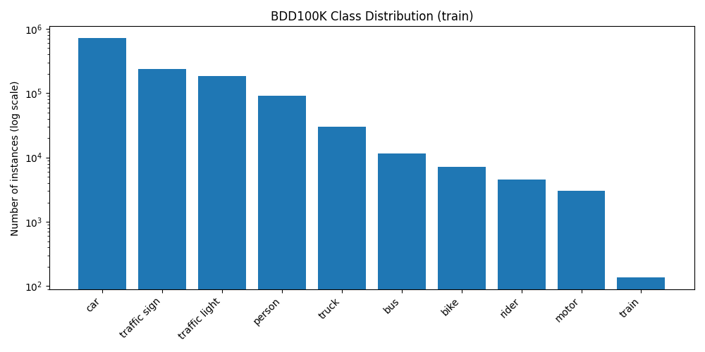
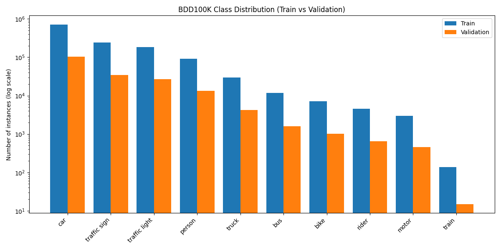
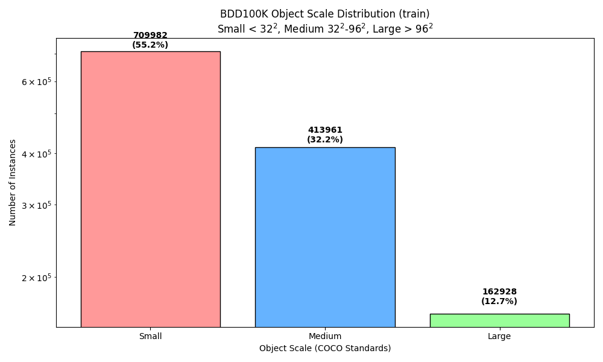
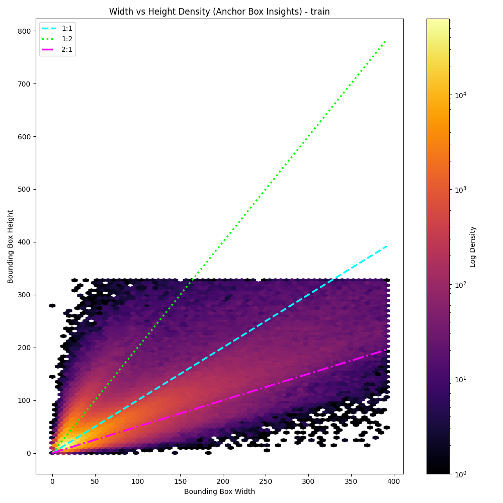
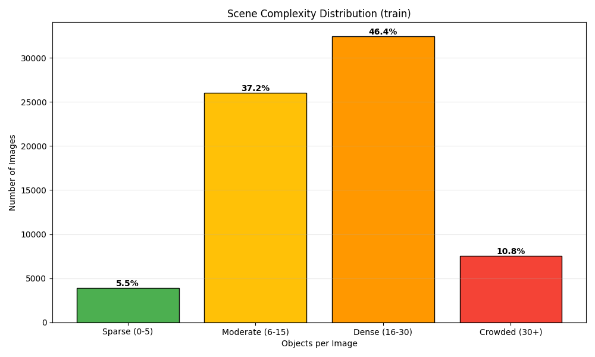
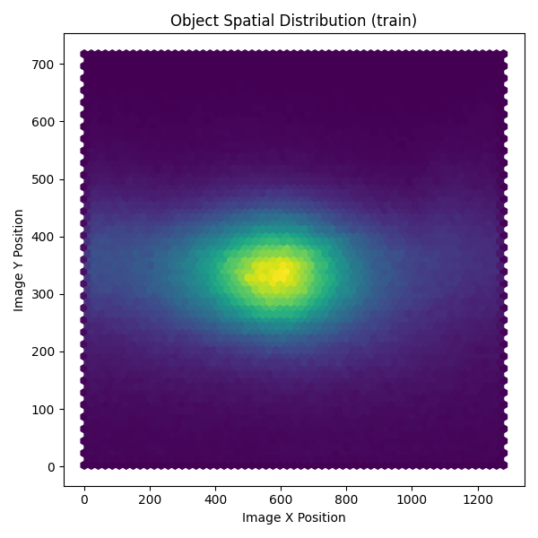
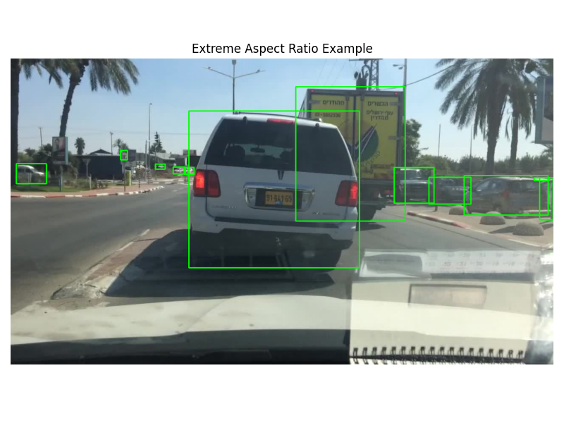
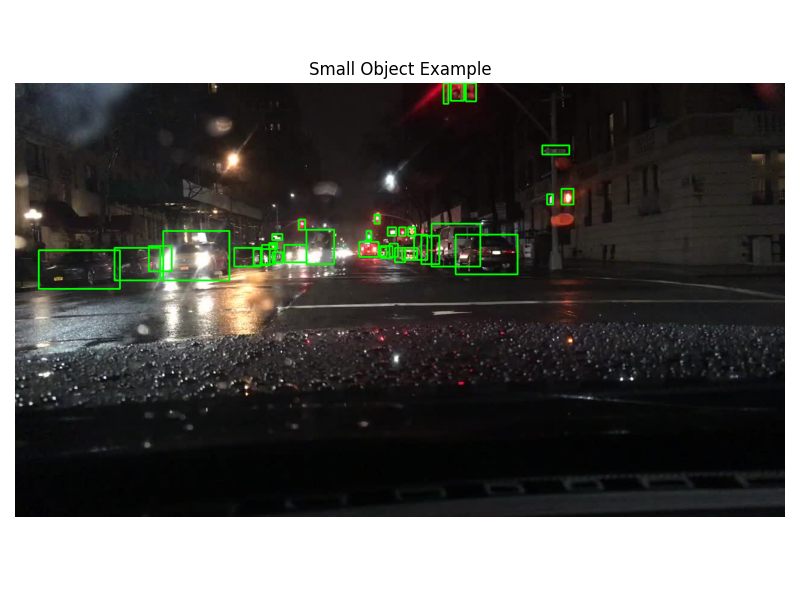
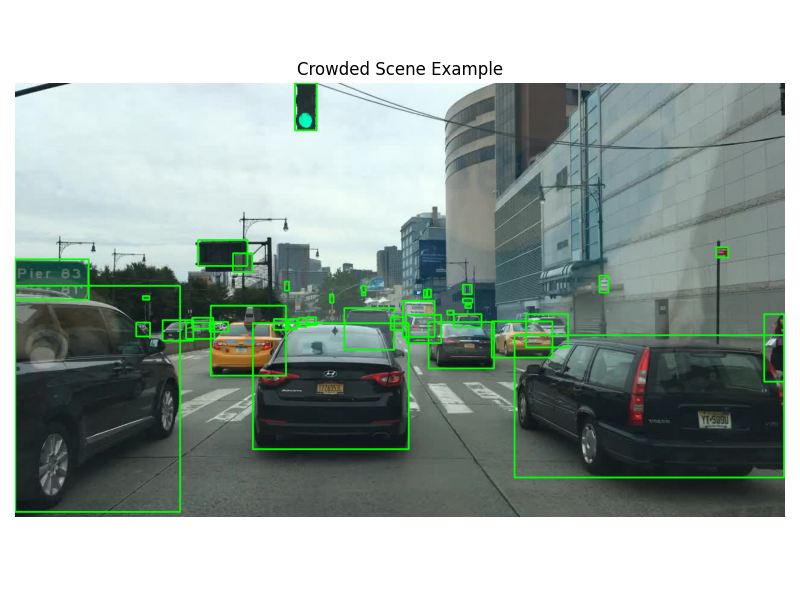

# BDD100K Object Detection – Data Analysis, Modeling, and Evaluation Report

## 1. Introduction

This report documents the analysis, modeling, and evaluation performed on the
BDD100K object detection dataset. The objective of this work is to understand
the dataset characteristics, identify potential challenges, build a baseline
object detection model, and evaluate its performance using both quantitative
and qualitative methods.

The analysis is structured to emphasize **data understanding before modeling**,
followed by a reproducible training and evaluation pipeline.

---

## 2. Dataset Overview

The BDD100K dataset is a large-scale autonomous driving dataset containing
images captured under diverse environmental conditions such as varying
weather, lighting, and traffic density.

### Dataset Scope
- Task: Object Detection
- Splits used: Train and Validation
- Total detection classes: 10
- Annotation format: Bounding boxes in JSON

### Object Detection Classes
- person
- rider
- car
- bus
- truck
- bike
- motor
- traffic light
- traffic sign
- train

Drivable area segmentation, lane markings, and other semantic segmentation
annotations were explicitly excluded from this analysis.

---

## 3. Data Analysis

### 3.1 Class Distribution Analysis

To understand the distribution of object categories in the dataset, the number of instances for each class was computed using the training split of the dataset.

The training split contains 69,863 images with a total of 1,286,871 annotated object instances across the ten detection classes.

The distribution of object instances per class is shown in **Table 1** and visualized in **Figure 1**.

**Table 1: Object Instance Distribution (Train Split)**
| Class         | Count   | Percentage |
| ------------- | ------- | ---------- |
| car           | 713,211 | 55.42%     |
| traffic sign  | 239,686 | 18.62%     |
| traffic light | 186,117 | 14.46%     |
| person        | 91,349  | 7.10%      |
| truck         | 29,971  | 2.33%      |
| bus           | 11,672  | 0.91%      |
| bike          | 7,210   | 0.56%      |
| rider         | 4,517   | 0.35%      |
| motor         | 3,002   | 0.23%      |
| train         | 136     | 0.01%      |
---

**Figure 1** shows the class distribution using a logarithmic scale to better visualize rare classes.
**Figure 1: Class Distribution (Train Split)**

Observations (from Class Distribution)

#### Observations

- The dataset shows **significant class imbalance**, with a few classes dominating the distribution.
- The **car class accounts for 55.42%** of all annotated objects, making it the most frequent category.
- **Traffic signs (18.62%) and traffic lights (14.46%)** are also highly represented in the dataset.
- The three most frequent classes (**car, traffic sign, traffic light**) together represent **88.5% of all objects**, indicating a strong **long-tail distribution**.
- Several classes are **extremely underrepresented**, including **motor (0.23%)**, **rider (0.35%)**, and **train (0.01%)**.
- The **train class appears only 136 times**, meaning cars appear **over 5,200 times more frequently than trains**.

#### Implications for Object Detection

- Object detection models trained on this dataset may become **biased toward dominant classes**, particularly cars.
- Rare classes such as **train, rider, and motor** may have **lower detection accuracy** due to limited training examples.
- The training loss may be **dominated by frequent classes**, making it harder for the model to learn representations for rare categories.
- The model may learn **strong priors for common objects**, potentially reducing sensitivity to rare but important objects.
- Techniques such as **class-balanced sampling, focal loss, or targeted data augmentation** may be required to improve detection performance for rare classes.

### 3.2 Train vs Validation Split Analysis

To ensure that the validation dataset is representative of the training data, the class distribution of object instances was compared across the two splits.

#### Class Distribution Comparison

The validation dataset contains **185,526 annotated objects** across the same 10 detection classes.  
**Table 2** compares the class distributions between the training and validation splits, which are visualized in **Figure 2**

**Table 2: Class Distribution Comparison (Train vs Validation)**

| Class | Train Count | Train % | Val Count | Val % |
|------|-------------|--------|-----------|-------|
| car | 713,211 | 55.42% | 102,506 | 55.24% |
| traffic sign | 239,686 | 18.62% | 34,908 | 18.82% |
| traffic light | 186,117 | 14.46% | 26,885 | 14.49% |
| person | 91,349 | 7.10% | 13,262 | 7.15% |
| truck | 29,971 | 2.33% | 4,245 | 2.29% |
| bus | 11,672 | 0.91% | 1,597 | 0.86% |
| bike | 7,210 | 0.56% | 1,007 | 0.54% |
| rider | 4,517 | 0.35% | 649 | 0.35% |
| motor | 3,002 | 0.23% | 452 | 0.24% |
| train | 136 | 0.01% | 15 | 0.01% |
---

**Figure 2: Class Distribution Comparison Between Train and Validation Splits.**

#### Observations

- The validation split follows **similar class distribution trends** as the training dataset.
- The **car class remains the dominant category** in both splits.
- **Traffic signs and traffic lights** are also among the most frequent classes in both datasets.
- Rare classes such as **train, motor, and rider** remain highly underrepresented.
- The **train class appears only 15 times in the validation set**, which further emphasizes its rarity.

#### Implications for Model Evaluation

- Since the validation distribution closely matches the training distribution, the validation set is **representative of the training data**.
- Performance metrics on the validation dataset are therefore **likely to reflect real training behavior**.
- However, evaluation for **rare classes may be unstable**, as very few validation examples exist for these categories.
- Metrics for classes such as **train, motor, and rider** should therefore be interpreted with caution.

---
### 3.3. Bounding Box Size Distribution

To understand the scale of objects in the dataset, **bounding box areas** were analyzed for all annotated objects in the training split. The bounding box area is computed as the product of the **bounding box width and height**.

The dataset contains **1,286,871 bounding boxes**. Summary statistics of the bounding box areas are shown in **Table 3**.

**Table 3: Bounding Box Area Statistics (Train Split)**
| Statistic          | Value           |
| ------------------ | --------------- |
| Count              | 1,286,871       |
| Mean               | 6,776 pixels²   |
| Standard Deviation | 22,850 pixels²  |
| Minimum            | 0.87 pixels²    |
| 25th Percentile    | 304 pixels²     |
| Median             | 817 pixels²     |
| 75th Percentile    | 3,022 pixels²   |
| Maximum            | 917,709 pixels² |

To further analyze object scales, bounding boxes were categorized using the **COCO object scale definitions**, where:

- **Small:** area < $32^2$ pixels  
- **Medium:** $32^2$ – $96^2$ pixels  
- **Large:** area > $96^2$ pixels  

The distribution of objects across these scale categories is illustrated in **Figure 3**.

**Figure 3: Object Scale Distribution in the BDD100K Training Set (COCO Scale Definitions).**

#### Observations

- The distribution of bounding box areas is **highly skewed toward small objects**.
- The **median area is 817 pixels²**, meaning that half of the objects occupy less than this area.
- The **mean area (6,776 pixels²)** is much larger than the median, indicating the presence of a few **very large objects** that increase the average.
- **25% of objects are smaller than 304 pixels²**, and **75% are smaller than 3,022 pixels²**, showing that most objects occupy relatively small image regions.
- Bounding box areas range from **0.87 pixels² to 917,709 pixels²**, reflecting a large variation in object scales.
- Based on the COCO scale categorization shown in **Figure 3**, approximately:
  - **55.2% of objects are small**
  - **32.2% are medium**
  - **12.7% are large**
  This confirms that the dataset is dominated by **small and medium-scale objects**, which is typical for urban driving scenarios.

#### Implications for Object Detection

- The high proportion of **small objects makes detection more challenging**, as they contain fewer pixels and visual details.
- Small objects are more likely to be lost in **downsampled feature maps** in deep neural networks.
- This issue is particularly important for **traffic lights and traffic signs**, which often appear far from the camera.
- Techniques such as **Feature Pyramid Networks (FPN)**, **higher-resolution feature maps**, and **multi-scale detection strategies** are commonly used to improve detection performance for small objects.

### 3.4 Bounding Box Aspect Ratio Analysis

To analyze the geometric characteristics of annotated objects, the **aspect ratio** of each bounding box was computed. The aspect ratio is defined as the ratio between the bounding box width and height:
$$
\[
\text{Aspect Ratio} = \frac{\text{width}}{\text{height}}
\]
$$
Aspect ratio analysis helps identify the **typical shapes of objects** in the dataset and detect **extreme bounding boxes** that may affect detection performance.

The summary statistics of aspect ratios for the training split are shown in **Table 4**, and the distribution is visualized in **Figure 4**.

**Table 4: Bounding Box Aspect Ratio Statistics (Train Split)**

| Statistic | Value |
|---|---|
| Count | 1,286,871 |
| Mean | 1.22 |
| Standard Deviation | 0.95 |
| Minimum | 0.0015 |
| 25th Percentile | 0.74 |
| Median | 1.10 |
| 75th Percentile | 1.49 |
| Maximum | 496.83 |

**Figure 4 shows the **joint distribution of bounding box width and height** using a density heatmap. Reference lines representing common aspect ratios (1:1, 1:2, and 2:1) are included to illustrate typical object shapes.**

#### Observations

- The median aspect ratio is **1.10**, indicating that most objects are slightly wider than they are tall.
- Approximately **50% of objects have aspect ratios between 0.74 and 1.49**, meaning most bounding boxes are close to **square or moderately rectangular**.
- The density heatmap in **Figure 4** reveals that the majority of objects cluster around the **1:1 and 2:1 aspect ratio regions**, corresponding to common object categories such as vehicles.
- A smaller cluster appears along the **1:2 aspect ratio line**, which likely corresponds to **tall objects such as pedestrians or traffic lights**.
- The dataset also contains **extreme aspect ratios**, ranging from **0.0015 to 496.83**, indicating the presence of very tall or very wide bounding boxes.
- These extreme values may arise from **elongated objects**, **partially visible objects near image boundaries**, or **annotation inconsistencies**.

#### Implications for Object Detection

Aspect ratio distribution is important for **anchor-based detectors** such as Faster R-CNN or YOLO.

- If anchor box shapes do not match the true object shape distribution, the model may struggle to **localize objects accurately**.
- The clustering observed in **Figure 4** suggests that most objects can be captured using a small set of anchor ratios.
- Since most aspect ratios fall between **0.74 and 1.49**, anchor ratios such as **0.5, 1.0, and 2.0** are likely sufficient to represent the majority of objects.
- However, objects with **extreme aspect ratios** may still be difficult for standard anchors to represent, potentially affecting detection performance.
- Understanding the aspect ratio distribution helps guide **anchor design and bounding box regression strategies** in object detection models.

### 3.5 Scene Complexity Analysis

In addition to object-level statistics, it is important to analyze the **number of objects present in each image**. This metric reflects the **complexity of driving scenes** and provides insight into how crowded the dataset is.

Scene density was computed by counting the number of annotated objects in each image of the training split.

The training split contains **69,863 images**. Summary statistics for the number of objects per image are shown in **Table 5**.

**Table 5: Objects per Image Statistics (Train Split)**

| Statistic | Value |
|---|---|
| Count | 69,863 |
| Mean | 18.42 |
| Standard Deviation | 9.62 |
| Minimum | 3 |
| 25th Percentile | 11 |
| Median | 17 |
| 75th Percentile | 24 |
| Maximum | 91 |
---
To better interpret scene complexity, images were categorized based on the number of objects they contain:

- **Sparse:** 0–5 objects  
- **Moderate:** 6–15 objects  
- **Dense:** 16–30 objects  
- **Crowded:** more than 30 objects  

**Figure 6: Scene complexity distribution in the BDD100K training split, categorized by the number of objects per image. Most scenes are moderately dense or dense, indicating that the dataset frequently contains multiple interacting objects typical of urban driving environments.**

#### Observations

- The **average scene contains approximately 18 objects**, indicating that most driving scenes include multiple interacting elements such as vehicles, pedestrians, and traffic infrastructure.
- The **median number of objects per image is 17**, suggesting that most scenes exhibit **moderate to high complexity**.
- As shown in **Figure 5**, the largest portion of the dataset (**46.4%**) falls into the **dense category (16–30 objects)**.
- Approximately **37.2% of images contain 6–15 objects**, representing moderately complex scenes.
- Only **5.5% of images are sparse**, meaning most images contain several annotated objects.
- About **10.8% of scenes are crowded**, containing more than 30 objects, which likely corresponds to busy urban environments.

#### Implications for Object Detection

High scene density introduces several challenges for object detection systems:

- **Occlusion**, where objects partially block each other.
- **Overlapping bounding boxes** between nearby objects.
- **Visually cluttered scenes**, which make object boundaries harder to distinguish.

Object detection models must therefore be capable of detecting **multiple objects in close proximity** and handling **complex urban environments**. 

### 3.6 Small Object Analysis

Small objects are particularly challenging for object detection models because they occupy very few pixels in the image and contain limited visual information. To quantify this challenge, objects were classified as **small objects** if either their width or height was less than **10 pixels**.

Using this criterion, **135,254 bounding boxes** were identified as small objects in the training split.

**Table 5: Small Object Statistics (Train Split)**

| Metric | Value |
|------|------|
| Total Objects | 1,286,871 |
| Small Objects (<10 px) | 135,254 |
| Small Object Ratio | 10.51% |

#### Observations

- Approximately **10.51% of all annotated objects are small objects**, meaning roughly **one out of every ten objects** occupies a very small region of the image.
- Small objects often correspond to objects that are **far from the camera** or naturally small in size.
- In autonomous driving scenes, small objects frequently include:
  - traffic lights  
  - traffic signs  
  - distant pedestrians  
  - far-away vehicles
- These objects occupy only a **few pixels in the image**, making them difficult to detect.

#### Implications for Object Detection

- Small objects contain **limited visual detail**, which makes detection more challenging.
- They may disappear in **downsampled feature maps** in deep neural networks.
- Small objects are more sensitive to **image noise and compression artifacts**.
- Reliable detection of small objects is critical for autonomous driving systems, since **traffic lights and road signs** often fall into this category.
- Modern detection architectures address this challenge using techniques such as:
  - **Feature Pyramid Networks (FPN)** for multi-scale feature representation
  - **higher-resolution feature maps**
  - **specialized small-object detection strategies**

Understanding the proportion of small objects in the dataset helps guide the design of detection models that are robust to **small-scale objects**.

### 3.7 Spatial Distribution of Objects

To analyze where objects typically appear within images, the **center coordinates of all bounding boxes** were computed and visualized as a **spatial heatmap**. The resulting visualization is shown in **Figure 5**.

**Figure 5: Spatial heatmap of bounding box centers in the training split.**

#### Observations

- The heatmap shows a **strong spatial concentration of objects near the center of the image**, particularly around the horizontal midpoint.
- The highest density occurs around **x ≈ 600 pixels**, corresponding to the center of the camera's field of view.
- Vertically, the highest concentration occurs around **y ≈ 320–350 pixels**, which represents the region where the road and vehicles in front of the ego vehicle are typically visible.
- Object density gradually **decreases toward the top and bottom edges of the image**, indicating fewer annotated objects in these areas.
- This spatial pattern reflects the natural geometry of driving scenes:

| Image Region | Typical Objects |
|--------------|----------------|
| Upper region | traffic lights, traffic signs |
| Middle region | vehicles, pedestrians |
| Lower region | nearby vehicles, road surface |

- The central concentration also indicates that most annotated objects are **directly in front of the ego vehicle**, consistent with the placement of forward-facing cameras in autonomous driving systems.

#### Implications for Object Detection

- The spatial distribution introduces **location bias** in the dataset.
- Detection models may implicitly learn that important objects are **more likely to appear near the center of the image**.
- While this bias can help models learn contextual cues, it may **reduce generalization** if objects appear in unusual locations.
- Understanding spatial patterns helps identify dataset biases and supports the design of models that remain **robust to different camera viewpoints and object positions**.

### 3.8 Annotation Anomalies

During dataset analysis, several potential annotation anomalies and edge cases were identified. These anomalies can impact model training and evaluation if not properly handled.

#### Extreme Aspect Ratios

Bounding boxes with extremely large or small aspect ratios were observed in the dataset.

- Aspect ratios greater than **5** or smaller than **0.2** were flagged as potential anomalies.
- These cases may correspond to:
  - vertically elongated objects such as **traffic lights**
  - partially visible objects near image boundaries
  - possible annotation inconsistencies.

Such extreme shapes may make it difficult for anchor-based detectors to match suitable anchor boxes.

**Figure 6: An example image illustrating extreme aspect ratio bounding boxes.**

#### Extremely Small Bounding Boxes

Some bounding boxes have very small dimensions, with areas approaching **1 pixel²**.

These cases typically correspond to:

- distant objects
- partially occluded objects
- small infrastructure elements such as traffic lights or signs.

Small objects contain limited visual information and are therefore harder for detection models to recognize.

**Figure 7: An example image illustrating Small objects.**

#### Crowded Scenes

Certain images contain **very high numbers of annotated objects**, with some scenes containing **up to 91 objects**.

These crowded scenes introduce challenges such as:

- object occlusion
- overlapping bounding boxes
- visually cluttered environments.

Such cases can increase the difficulty of object detection and may lead to missed detections.

**Figure 8: An example image illustrating Small objects.**

#### Impact on Model Training

These anomalies highlight potential challenges for object detection models:

- extreme bounding box shapes may affect anchor matching
- small objects are harder to detect in downsampled feature maps
- crowded scenes increase occlusion and overlapping detections.

Understanding these cases helps ensure that the dataset is properly interpreted before training detection models.

## 4. Model Selection and Architecture

### Overview

The object detection model used in this project is **Faster R-CNN with a Swin Transformer backbone and Feature Pyramid Network (FPN)**. This architecture combines the strong localization accuracy of **two-stage detectors** with the powerful feature extraction capabilities of **transformer-based vision models**.

Faster R-CNN follows a **two-stage detection pipeline**. In the first stage, candidate object regions are generated using a **Region Proposal Network (RPN)**. In the second stage, these regions are classified into object categories and their bounding boxes are refined.

The architecture consists of the following components:

1. Swin Transformer Backbone  
2. Feature Pyramid Network (FPN)  
3. Region Proposal Network (RPN)  
4. ROI-based Detection Head  

---

### 4.1 Model Architecture
             Input Image
                  │
                  ▼
      Swin Transformer Backbone
    (Shifted Window Self-Attention)
                  │
                  ▼
       Multi-scale Feature Maps
                  │
                  ▼
     Feature Pyramid Network (FPN)
                  │
                  ▼
    Region Proposal Network (RPN)
     ├─ Anchor Generation
     ├─ Objectness Score
     └─ Bounding Box Refinement
                  │
                  ▼
             ROI Align
                  │
                  ▼
          Detection Head
     ├─ Classification Layer
     └─ Bounding Box Regressor
                  │
                  ▼
          Final Object Detections

---

### 4.2 Swin Transformer Backbone

The backbone network extracts hierarchical feature representations from the input image. In this project, the backbone is a **Swin Transformer (Swin-Tiny)**.

Unlike traditional convolutional networks, the Swin Transformer uses **self-attention mechanisms** to model relationships between different image regions. It introduces **shifted window attention**, which limits attention computation to local windows while still allowing cross-window information exchange between layers.

This design allows the model to efficiently capture both **local spatial patterns and global contextual information**, which is important for understanding complex scenes in autonomous driving datasets.

---

### 4.3 Feature Pyramid Network (FPN)

Objects in driving scenes appear at different scales. The **Feature Pyramid Network (FPN)** combines feature maps from multiple backbone layers to create a **multi-scale feature representation**.

High-resolution features help detect small objects such as traffic lights and traffic signs, while low-resolution features capture larger objects like buses and trucks.

---

### 4.4 Region Proposal Network (RPN)

The **Region Proposal Network** generates candidate object regions using **anchor boxes** of different scales and aspect ratios. For each anchor, the RPN predicts:

- an **objectness score** indicating whether the region contains an object  
- **bounding box offsets** to refine the anchor location  

The most promising proposals are passed to the next stage of the detection pipeline.

---

### 4.5 ROI-Based Detection Head

The second stage of Faster R-CNN processes the proposed regions using **ROI Align**, which extracts fixed-size feature maps for each proposal.

The detection head performs two tasks:

- **Object classification** to predict the category of the object
- **Bounding box regression** to refine the object location

The final output of the model consists of object labels, bounding box coordinates, and confidence scores.

---

### 4.6 Relationship Between Dataset Analysis and Model Selection

The dataset analysis performed on the BDD100K dataset revealed several important characteristics that influenced the choice of the detection model.

#### Small Object Dominance

Bounding box analysis showed that a large proportion of objects in the dataset are **small**, particularly **traffic lights and traffic signs**. Small objects contain limited visual information and can disappear in deeper network layers due to spatial downsampling.

To address this challenge, the model incorporates a **Feature Pyramid Network (FPN)**, which preserves high-resolution feature maps and improves detection performance for small objects.

---

#### Multi-Scale Object Distribution

The bounding box area distribution showed that objects in the dataset vary significantly in size, ranging from very small objects to large vehicles. This large variation requires a detector capable of handling **multi-scale objects**.

The **anchor-based Region Proposal Network** generates proposals at multiple scales and aspect ratios, allowing the model to detect objects of different sizes effectively.

---

#### Aspect Ratio Variability

Aspect ratio analysis revealed that most objects have ratios between **0.74 and 1.49**, but some objects exhibit extreme shapes, such as vertically elongated traffic lights.

To accommodate this variation, the anchor generator includes **multiple aspect ratios**, allowing the model to better match objects with different geometric shapes.

---

#### Scene Complexity

Scene density analysis showed that images often contain **many objects per image**, with an average of approximately **18 objects per scene**. Dense urban environments frequently contain overlapping objects and occlusions.

Two-stage detectors such as **Faster R-CNN** are well suited for these scenarios because the second-stage ROI processing improves localization accuracy in crowded scenes.

---

#### Backbone Choice

A **Swin Transformer backbone** was selected to improve feature representation. The transformer architecture captures **long-range dependencies and contextual relationships**, which are important in complex driving scenes where object understanding depends on surrounding context.

---

### 4.7 Final Model Design

Based on the dataset analysis, the final model architecture consists of:

- **Swin Transformer backbone** for strong feature representation and contextual understanding
- **Feature Pyramid Network (FPN)** for multi-scale feature extraction and improved small-object detection
- **Region Proposal Network (RPN)** for anchor-based proposal generation
- **ROI-based detection head** for accurate classification and bounding box regression

This architecture is well suited for the characteristics observed in the BDD100K dataset, including **small objects, large scale variations, and complex urban scenes**.

---

## 6. Evaluation Metrics

### 6.1 Quantitative Metrics

The following metrics were computed on the validation dataset:
- True Positives (TP)
- False Positives (FP)
- False Negatives (FN)
- Precision
- Recall

An IoU threshold of 0.5 was used to determine correct detections.

Precision and recall were chosen because:
- They provide insight into class-wise performance
- They highlight the impact of class imbalance
- They expose failure modes such as missed detections

---

### 6.2 Quantitative Results Analysis

The evaluation results indicate:
- Higher precision and recall for frequent classes such as `car`.
- Lower recall for rare and small-object classes such as `traffic sign`,
  `traffic light`, and `train`.

These results align with the observations from the data analysis stage.

---

## 7. Qualitative Evaluation and Failure Analysis

Qualitative evaluation focused on inspecting failure cases, particularly:
- Images where ground-truth objects were missed entirely
- Scenes with small or heavily occluded objects
- Crowded urban environments

Observed failure patterns:
- Small objects are frequently missed.
- Rare classes suffer from low recall.
- Crowded scenes increase false negatives.

These failure modes are consistent with the dataset characteristics identified
during data analysis.

---

## 8. Connecting Data Analysis to Model Performance

The evaluation results strongly correlate with the data analysis findings:
- Class imbalance leads to uneven performance across categories.
- Small bounding boxes result in lower detection recall.
- Rare classes are insufficiently represented for robust learning.

This highlights the importance of thorough dataset analysis prior to model
development.

---

## 9. Suggested Improvements

Based on the analysis and evaluation, potential improvements include:
- Class-aware sampling or reweighting strategies
- Data augmentation targeted at small objects
- Higher-resolution input images
- Collecting additional data for rare classes
- Using loss functions designed for class imbalance (e.g., focal loss)

These improvements could help mitigate the identified weaknesses.

---

## 10. Conclusion

This project demonstrates a complete and reproducible object detection pipeline
for the BDD100K dataset, covering:
- Structured data analysis
- Identification of dataset challenges
- Baseline model training
- Quantitative and qualitative evaluation
- Data-driven performance interpretation

The results emphasize that dataset characteristics such as class imbalance,
small objects, and crowded scenes play a critical role in determining object
detection performance.

This analysis provides a strong foundation for future model improvements and
more advanced experimentation.
